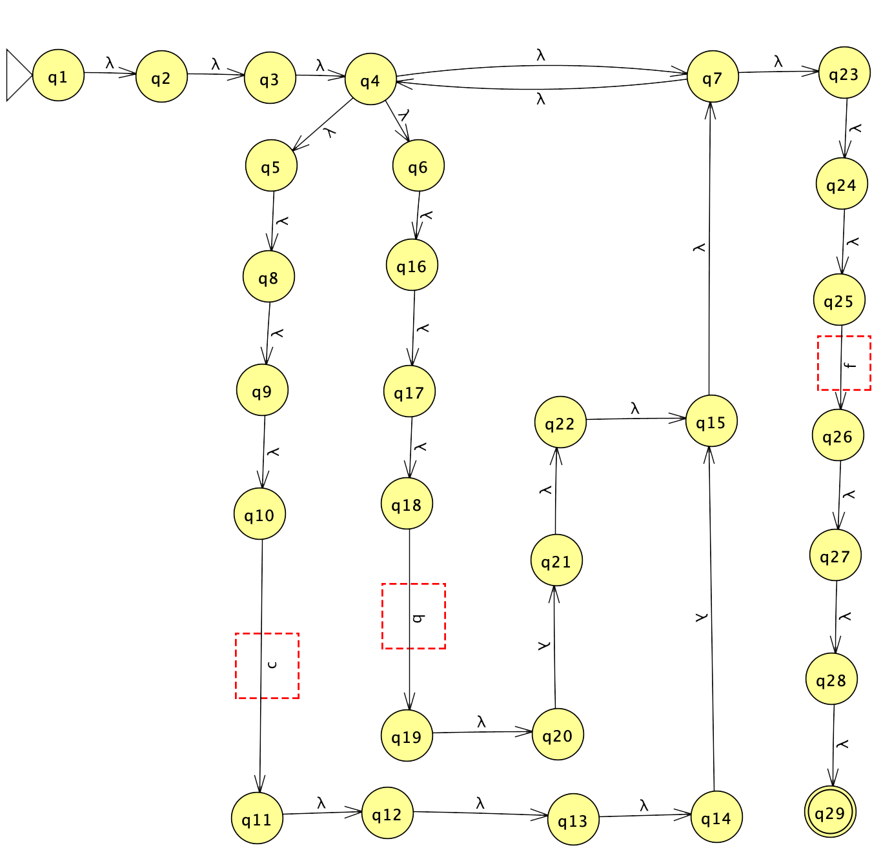

# Regular Expression Parser

A utility tool used for validating regular expressions corresponding to a provided word

## Overview

The tool accepts a regular expression. Afterwards, a ``ε-NFA(Epsilon Non-Deterministic Finite Automata)`` is constructed based on the regular expression. The automata has the capability to check whether a certain word is accepted or rejected by traversing from an initial to a final state.

#### Supported special symbols:
`(` : Opening bracket

`)` : Closing bracket

`+` : Kleene plus

`*` : Kleene star

`|` : Logical `or` operator

## Example

Construct a ``FiniteAutomation`` with a regular expresion and flags. The flags specify whether the automata should include an initial and/or a final state.

```C++
FiniteAutomation automation("(c|f)*f", true, true);
```

The constructed automata can be printed in the console using the ``printFromInitialState`` method. The regular expression ``(c|f)*f`` generates the following output:

```
[start->(1)-#->(2)] [(2)-#->(3)] [(3)-#->(4)] [(4)-#->(5)(4)-#->(6)(4)-#->(7)] [(5)-#->(8)] [(8)-#->(9)] [(9)-#->(10)] [(10)-c->(11)] [(11)-#->(12)] [(12)-#->(13)] [(13)-#->(14)] [(14)-#->(15)] [(15)-#->(7)] [(6)-#->(16)] [(16)-#->(17)] [(17)-#->(18)] [(18)-b->(19)] [(19)-#->(20)] [(20)-#->(21)] [(21)-#->(22)] [(22)-#->(15)] [(7)-#->(23)(7)-#->(4)] [(23)-#->(24)] [(24)-#->(25)] [(25)-f->(26)] [(26)-#->(27)] [(27)-#->(28)] [(28)-#->(29)] [(29)->end]
```

The ``#`` symbol signifies the epsilon or lambda transitions. The visual representaion of the generated output is depicted below:



So as to check if a word is accepted by the ``automation`` instance, the ``isAccepted`` method is used:

```C++
bool isAccepted = automation.isAccepted("cbbcbcbbcf");
cout << isAccepted // '1' would be outputed
```
